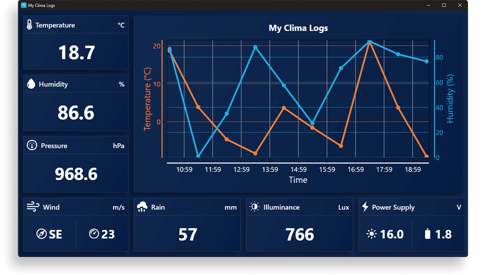
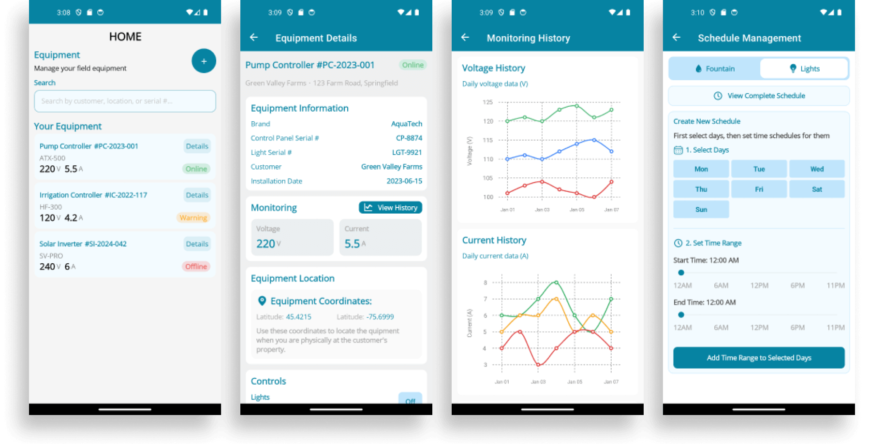
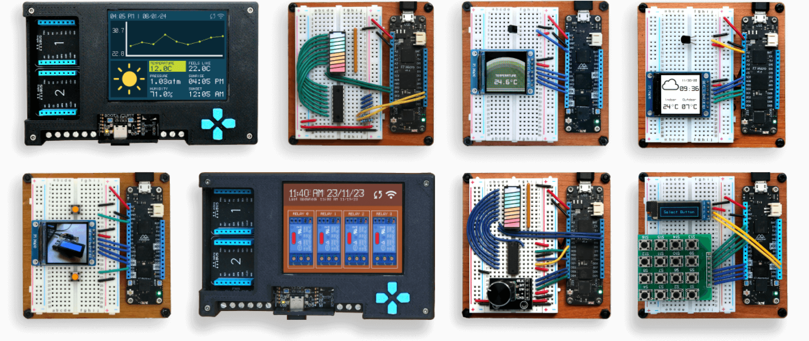
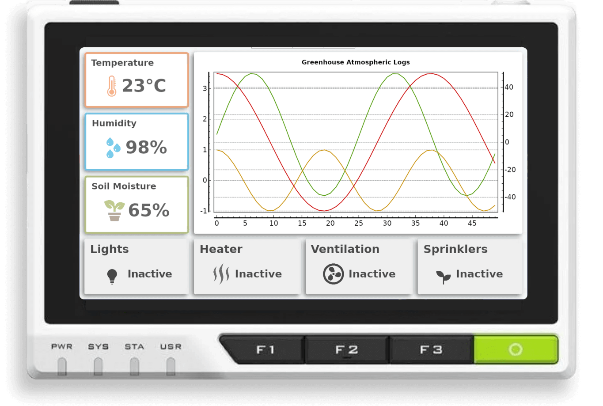

    

## Hi there 👋

I'm a Software Developer passionate about turning customer ideas into intuitive, visually polished applications. With over 10 years working with .NET, I've built a wide range of applications for mobile, desktop, even embedded devices. 

Over the years, I have honed my skills in building pixel-perfect, robust and scalable desktop applications. 

Building intricate layouts using XAML and overall app architecture using MVVM ensure best practices for maintainable and testable code. 

Built an extensive collection of easy-to-follow samples and tutorials to the most advanced IoT .NET platform in the market. 

My keen eye for detail drives me to build high-quality applications that provide a seamless user experience. 

    

    
    
    
    
    

<!--
**jorgedevs/jorgedevs** is a ✨ _special_ ✨ repository because its `README.md` (this file) appears on your GitHub profile.

Here are some ideas to get you started:

- 🔭 I’m currently working on ...
- 🌱 I’m currently learning ...
- 👯 I’m looking to collaborate on ...
- 🤔 I’m looking for help with ...
- 💬 Ask me about ...
- 📫 How to reach me: ...
- 😄 Pronouns: ...
- ⚡ Fun fact: ...
-->
